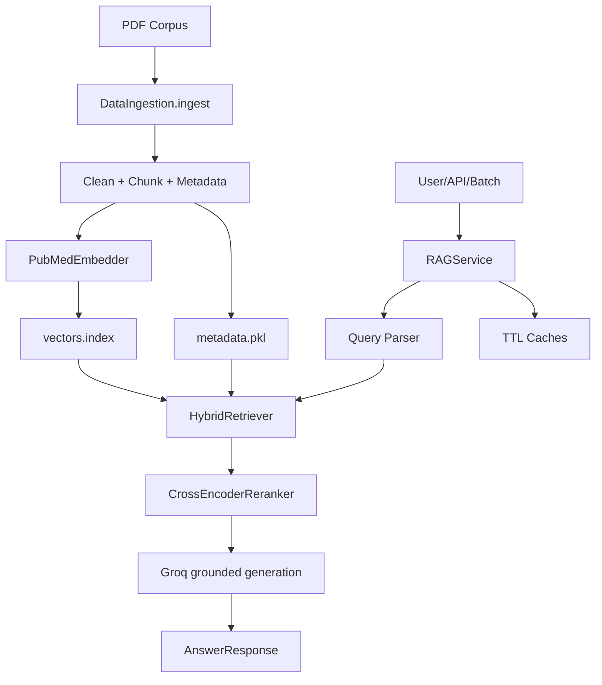

# Architecture Review

## Executive Summary

This repository is a medical RAG system with a working ingestion pipeline, FAISS vector index, lexical scoring, metadata filtering, CLI QA, and batch inference. The modernization pass preserves those behaviors and adds production boundaries: service orchestration, structured logging, telemetry, bounded caches, HTTP API, evaluation utilities, Docker, Compose, CI, and runtime configuration.

## Issues Fixed

| Issue | Severity | Why It Matters | Industry Practice | Implemented Solution |
| --- | --- | --- | --- | --- |
| CLI code directly orchestrated parsing, retrieval, and generation | High | Hard to reuse in APIs, jobs, and tests | Put business flow behind an application service | Added `rag_system.service.RAGService` with typed request/response models |
| No structured logging | High | Production logs are hard to search and correlate | JSON logs with consistent fields | Added `rag_system.logging_config` and wired CLI/bulk logging |
| No service health/readiness surface | High | Deployments need liveness/readiness checks | `/health` and `/ready` endpoints | Added FastAPI app factory in `rag_system.api` |
| No retrieval/response cache | Medium | Repeated questions reload expensive retrieval/generation work | Bounded TTL caches with stable keys | Added `rag_system.cache.CacheManager` |
| No first-class telemetry | Medium | Latency and failure trends are invisible | Metrics around key operations | Added `rag_system.telemetry.MetricsRegistry` and tracing context manager |
| Runtime config limited to ingestion/retrieval | Medium | API, cache, logging, and service behavior need env control | Central typed settings with validation | Extended `Settings` with production runtime fields |
| No deployment artifacts | High | Reproducible service startup was missing | Docker image and Compose service | Added `Dockerfile`, `docker-compose.yml`, `scripts/run_api.py` |
| No CI definition | High | Regressions are easy to miss | Compile and test on every push/PR | Added `.github/workflows/ci.yml` |
| No evaluation harness | Medium | Quality regressions need repeatable checks | Versioned eval cases and metrics | Added `rag_system.evaluation` |
| No benchmark harness | Medium | Latency regressions need measurement | Repeatable service-level benchmarks | Added `rag_system.benchmark` |

## Current High-Level Flow

## Remaining Strategic Opportunities

The system is now production-runnable, but large-scale enterprise deployment can continue with external vector stores, distributed tracing exporters, asynchronous ingestion queues, persisted semantic cache storage, and dedicated model-serving infrastructure.

