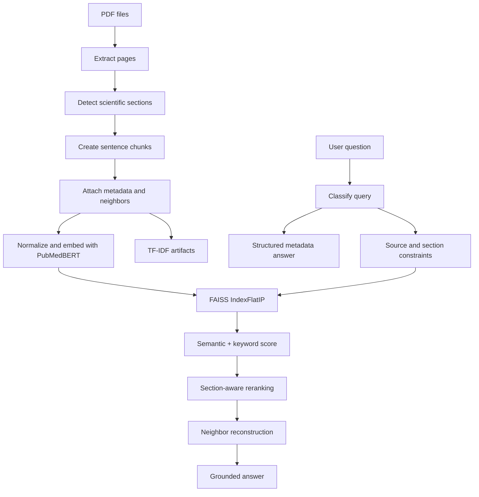
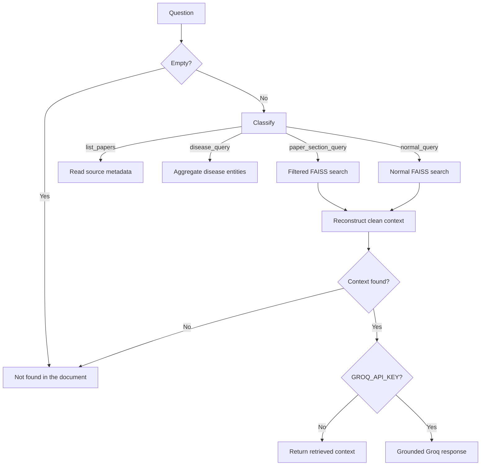

# Medical RAG System: Working and Concepts

This guide explains how the project ingests medical PDFs, creates searchable FAISS vectors, understands different query types, filters metadata, ranks evidence, reconstructs context, and generates grounded answers.

## 1. Purpose

The system supports:

- Semantic retrieval with `NeuML/pubmedbert-base-embeddings` and FAISS.
- Exact PDF filtering when a paper ID is supplied.
- Exact filtering for Abstract, Introduction, Methods, Results, Discussion, and Conclusion.
- Structured paper-list and disease-list responses.
- Semantic, keyword, and section-aware ranking.
- Removal of tables, figures, download banners, references, and numeric OCR noise.
- Neighbor context without crossing into another PDF or requested section.
- Grounded answers with source, section, and page provenance.

The command-line entry points are:

- `DataIngestion.py`: builds the database.
- `question-vector.py`: interprets questions, retrieves evidence, and answers.

## 2. Architecture



## 3. Project structure

```text
rag/
├── DataIngestion.py
├── question-vector.py
├── RAG_SYSTEM_GUIDE.md
├── requirements.txt
└── rag_system/
    ├── ingestion/
    │   ├── DataIngestion.py
    │   ├── chunking.py
    │   └── embedding.py
    ├── retrieval/
    │   ├── hybrid_search.py
    │   ├── reranker.py
    │   └── retriever.py
    └── utils/
        ├── config.py
        └── preprocessing.py
```

The root `DataIngestion.py` is a compatibility entry point. The modular implementation is under `rag_system/`.

## 4. Ingestion pipeline

Run ingestion with:

```powershell
python DataIngestion.py --pdf-dir pdfs --output-dir output
```

### 4.1 PDF loading

`load_pdf()` uses `pypdf.PdfReader`. Each PDF page becomes:

```python
PageText(text="extracted text", page_number=1)
```

Pages remain identifiable during chunk construction. This preserves the page number instead of losing it by merging the entire PDF first.

### 4.2 Section detection

`chunk_pages()` recognizes common scientific headings:

- Abstract
- Introduction or Background
- Methods, Methodology, or Materials and Methods
- Results
- Discussion
- Conclusion or Summary

Aliases become canonical values. For example, `Background` becomes `introduction`, and `Methodology` becomes `methods`. Text before a known heading is marked `unknown`.

### 4.3 Sentence chunking

Text is split on sentence boundaries. Sentences accumulate until the chunk target is reached.

```python
chunk_size = 400
chunk_overlap = 64
```

- Chunk size must be 300–500 estimated tokens.
- Overlap must be 50–80 estimated tokens.
- Overlap repeats final sentences in the next chunk to preserve boundary context.
- Overlap never crosses a section boundary.

### 4.4 Metadata

Every chunk stores:

```python
{
    "chunk_id": "stable hash",
    "text": "chunk content",
    "section": "abstract",
    "source": "32969527.pdf",
    "page_number": 1,
    "prev_chunk_id": None,
    "next_chunk_id": "next hash",
    "ordinal": 0
}
```

| Field | Function |
|---|---|
| `chunk_id` | Uniquely identifies the chunk. |
| `text` | Supplies embedding input and answer evidence. |
| `section` | Supports section filtering and boosts. |
| `source` | Restricts search to an exact PDF. |
| `page_number` | Provides traceable provenance. |
| `prev_chunk_id` | Finds preceding context. |
| `next_chunk_id` | Finds following context. |
| `ordinal` | Preserves document order. |

Neighbor links are assigned after low-quality chunks are removed. Stored links therefore do not point to filtered-out chunks.

### 4.5 Shared preprocessing

`normalize_for_embedding()` is used for both document and query embeddings. It applies:

1. Unicode normalization.
2. Soft-hyphen removal.
3. PDF line-break hyphen repair.
4. Control-character removal.
5. Citation cleanup.
6. Repeated-punctuation cleanup.
7. Whitespace normalization.
8. Lowercasing.

Using the same pipeline prevents document/query embedding drift.

### 4.6 Embeddings

The fixed model is:

```text
NeuML/pubmedbert-base-embeddings
```

`PubMedEmbedder.encode()` processes text in batches, converts vectors to `float32`, and L2-normalizes them. For normalized vectors, inner product equals cosine similarity:

```text
similarity(query, chunk) = query_vector · chunk_vector
```

The model name and dimension are persisted. Query-time loading rejects an incompatible model or vector dimension.

### 4.7 FAISS and lexical artifacts

The vector index is explicitly:

```python
faiss.IndexFlatIP(embedding_dimension)
```

`IndexFlatIP` performs exact inner-product search. A TF-IDF vectorizer and matrix are also saved for lexical matching and future hybrid extensions.

Generated files:

```text
output/
├── chunks_manifest.json
└── faiss_index/
    ├── vectors.index
    └── metadata.pkl
```

- `vectors.index`: FAISS vectors.
- `metadata.pkl`: records, model contract, ID map, and TF-IDF objects.
- `chunks_manifest.json`: human-readable chunk metadata.

Only load `metadata.pkl` from this application. Pickle files from untrusted sources are unsafe.

## 5. Query understanding

### 5.1 `extract_paper_id()`

The function uses:

```python
re.search(r"(\d{6,})", query)
```

It recognizes:

```text
32969527
32969527.pdf
paper 32969527
get introduction of 32969527.pdf
```

The ID becomes `32969527.pdf` for source filtering. Legacy metadata containing only the filename stem is also supported.

### 5.2 `extract_section()`

This function searches the lowercased query for:

```text
abstract, introduction, methods, results,
discussion, conclusion
```

| Query | Result |
|---|---|
| `get abstract of 32969527.pdf` | `abstract` |
| `show methods in paper 32969527` | `methods` |
| `what did the paper find?` | `None` |

### 5.3 `classify_query()`

The classifier routes a query before retrieval:

| Type | Detection | Action |
|---|---|---|
| `list_papers` | Contains `list` and `paper` | List sources directly from metadata. |
| `disease_query` | Contains `disease` | Aggregate diseases across applicable records. |
| `paper_section_query` | Contains paper ID and section | Restrict FAISS to that PDF and section. |
| `normal_query` | Anything else | Use normal RAG retrieval. |

This prevents structured requests such as `list all papers` from returning one random vector-search result.

### 5.4 `preprocess_query()`

The function:

1. Lowercases the question.
2. extracts the PDF filename or paper ID.
3. Corrects a small set of common question typos.
4. Removes filler words.
5. Expands disease-description questions with relevant paper terms.

Example:

```text
Input:
wha us disease described in 32969527.pdf

Output:
{
    "clean_query": "disease described study abstract introduction",
    "source_filter": "32969527.pdf"
}
```

## 6. Structured responses

### 6.1 List all papers

For `list all papers`, FAISS is not appropriate because the answer already exists in metadata.

`list_papers()`:

1. Reads every metadata record.
2. Extracts `source`.
3. Removes `.pdf` for display.
4. Deduplicates and sorts IDs.

```text
📄 Papers in database:
25923550
27022036
32469185
32969527
```

This result is deterministic and complete.

### 6.2 Name all diseases

`disease_response()` aggregates instead of answering from one top chunk:

1. Read metadata entities beginning with `disease:`.
2. Scan clean record text with the medical disease pattern.
3. Normalize names to lowercase.
4. Deduplicate and sort.

If the query contains a paper ID, only that paper is scanned. Otherwise, all records are scanned.

```text
🧬 Diseases found:
- adenocarcinoma
- lung cancer
- squamous cell carcinoma
```

Metadata entities are preferred. The regex supplements metadata but cannot represent every possible biomedical entity; a biomedical NER model would be the next step for open-vocabulary extraction.

## 7. Metadata-constrained FAISS search

### 7.1 Why filtering happens before search

Searching the full index and filtering afterward is inaccurate. If the global top 10 all belong to other PDFs, the requested paper never reaches the filter.

`IndexFlatIP` has no arbitrary metadata predicate. The system therefore:

1. Enumerates metadata positions.
2. Keeps clean positions matching `source_filter`.
3. Keeps positions matching `section_filter` when supplied.
4. Reconstructs only those vectors from the primary FAISS index.
5. Adds them to a temporary `IndexFlatIP`.
6. Searches only that subset.

This guarantees that another paper cannot displace the requested PDF during similarity search.

### 7.2 Source matching

Source comparison is case-insensitive and uses the filename. It supports:

```text
metadata source: 32969527.pdf
query source:    32969527.pdf
```

It also supports legacy metadata:

```text
metadata source: 32969527
query source:    32969527.pdf
```

### 7.3 Section filtering

For:

```text
get introduction of 32969527.pdf
```

the effective request is:

```python
source_filter = "32969527.pdf"
section_filter = "introduction"
retrieval_query = "introduction of research paper"
```

Only vectors satisfying both constraints enter FAISS search.

### 7.4 Fallback behavior

If no searchable row matches the requested source, the required fallback searches the clean global database. An explicit section constraint remains active. In a strict isolation deployment, this fallback can instead return `Not found in the document`.

## 8. Noise removal and text repair

### 8.1 `is_noisy()`

A chunk is rejected when it contains:

- `table`
- `figure`
- `downloaded from`
- `references`
- More than 30% numeric characters

Filtering happens before FAISS subset construction and again before reranking.

### 8.2 `clean_text()`

Common PDF artifacts are repaired:

```text
multi- plexed       → multiplexed
oncogeneaddicted    → oncogene-addicted
camelCase           → camel Case
repeated whitespace → one space
```

General arbitrary joined-word repair requires a dictionary-aware segmenter or higher-quality PDF parser; the current rules target observed extraction failures without modifying valid medical terms.

## 9. Hybrid scoring and reranking

### 9.1 Semantic score

FAISS returns the inner product of normalized vectors:

```text
semantic_score = normalized_query · normalized_chunk
```

This retrieves conceptually similar passages even when wording differs.

### 9.2 Keyword score

```python
q_words = set(query.split())
t_words = set(text.split())
keyword_score = len(q_words & t_words) / (len(q_words) + 1)
```

The `+1` prevents division by zero and slightly regularizes short queries.

### 9.3 Section boost

| Section | Adjustment |
|---|---:|
| Abstract | `+0.25` |
| Introduction | `+0.25` |
| Methods | `+0.10` |
| Discussion | `-0.10` |
| Table | `-0.10` |
| Other | `0.00` |

### 9.4 Final formula

```text
final_score =
    0.7 × semantic_score
  + 0.3 × keyword_score
  + section_boost
```

FAISS retrieves up to 10 clean candidates. Reranking applies this formula and returns the top 3.

## 10. Context reconstruction

The selected chunk may start after a definition or end before a conclusion. The retriever therefore attempts:

```text
previous chunk → selected chunk → next chunk
```

A neighbor is included only if:

- Its ID exists.
- It has not already been included.
- It belongs to the same PDF.
- It is not noisy.
- For a section query, it belongs to the same section.

The last rule prevents an Abstract request from expanding into the neighboring Introduction. The source rule prevents another PDF from entering context. Total reconstructed context is limited to approximately 2,000 tokens.

## 11. Output format

Each block contains provenance:

```text
[Source: 32969527.pdf | Section: abstract | Page: 1]
Cleaned paper text...
```

This lets users and the answer model trace evidence back to its PDF location.

## 12. Answer pipeline



The Groq prompt requires the model to answer only from context, include source/section information, avoid external knowledge, and return `Not found in the document` when evidence is absent.

Without `GROQ_API_KEY`, the system returns retrieved context directly. Retrieval can therefore be tested independently of answer generation.

## 13. Query examples

### Paper section

```text
Question:       get introduction of 32969527.pdf
Classification: paper_section_query
Source:         32969527.pdf
Section:        introduction
FAISS input:    only clean vectors from that source and section
Result:         top 3 with same-section neighbors
```

### List papers

```text
Question:       list all papers
Classification: list_papers
FAISS used:     no
Data source:    complete metadata records
```

### List diseases

```text
Question:       name all diseases
Classification: disease_query
FAISS used:     no
Data source:    disease metadata and clean text across records
```

### Normal question

```text
Question:       what treatment improved progression-free survival?
Classification: normal_query
FAISS:          top 10 clean semantic candidates
Reranking:      semantic + keyword + section adjustment
Output:         top 3 with reconstructed context
```

## 14. Configuration

Defaults in `rag_system/utils/config.py`:

| Setting | Default | Meaning |
|---|---:|---|
| `model_name` | `NeuML/pubmedbert-base-embeddings` | Shared embedding model. |
| `chunk_size` | `400` | Target tokens per chunk. |
| `chunk_overlap` | `64` | Repeated context tokens. |
| `embedding_batch_size` | `32` | Texts embedded per batch. |
| `semantic_weight` | `0.7` | Semantic score contribution. |
| `keyword_weight` | `0.3` | Keyword score contribution. |
| `candidate_k` | `10` | FAISS candidates. |
| `top_k` | `3` | Final chunks. |
| `max_context_tokens` | `2000` | Context budget. |
| `min_chunk_tokens` | `40` | Minimum ingestion chunk. |

Changing the embedding model requires rebuilding the index.

## 15. Running the project

Install dependencies:

```powershell
pip install -r requirements.txt
```

Add PDFs:

```text
pdfs/
├── 32969527.pdf
└── another-paper.pdf
```

Build the database:

```powershell
python DataIngestion.py --pdf-dir pdfs --output-dir output
```

Ask one question:

```powershell
python question-vector.py "get abstract of 32969527.pdf"
```

Interactive mode:

```powershell
python question-vector.py
```

Optional Groq answering:

```powershell
$env:GROQ_API_KEY="your-key"
python question-vector.py "what disease is described in 32969527.pdf"
```

## 16. Safeguards

- Empty queries return `Not found in the document`.
- Missing evidence returns the same deterministic fallback.
- Model-name and dimension mismatches stop index loading.
- Source matching supports current filenames and legacy stems.
- Noise is rejected before ranking and output.
- Structured queries bypass vector search when metadata is complete.
- Neighbors cannot cross PDF or requested-section boundaries.
- Context is deduplicated and budget-limited.

## 17. Verification checklist

After indexing real PDFs, verify:

1. `list all papers` shows each source once.
2. `get abstract of <id>.pdf` returns only that PDF and Abstract.
3. `get introduction of <id>.pdf` contains no Abstract or Discussion blocks.
4. `name all diseases` aggregates multiple records.
5. Returned context contains no tables, figures, references, or download banners.
6. Every block shows correct source, section, and page.
7. Neighbor expansion stays inside the same source and requested section.
8. Unsupported questions return `Not found in the document`.

