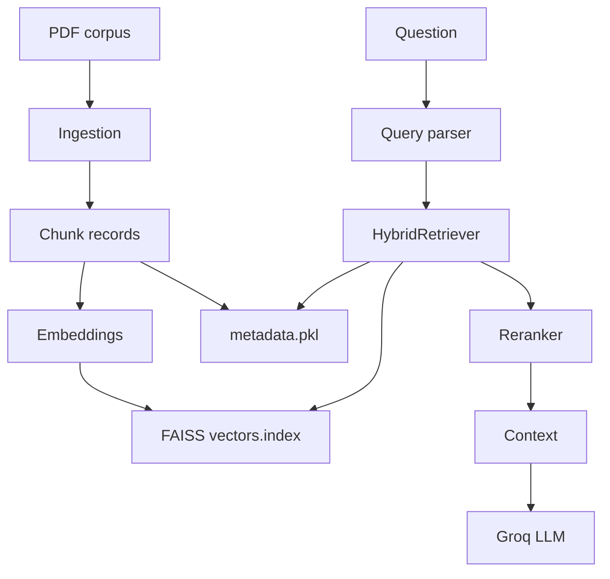

# Project Overview

## Table of Contents
- [Purpose](#purpose)
- [Inputs and Outputs](#inputs-and-outputs)
- [Supported Document Types](#supported-document-types)
- [Capabilities](#capabilities)
- [Limitations](#limitations)
- [Architecture](#architecture)
- [Design Philosophy](#design-philosophy)

## Purpose

This project implements a local medical RAG pipeline. It indexes biomedical PDFs and answers questions using retrieved chunks from those PDFs. The LLM prompt is precision-oncology oriented and explicitly focuses on NSCLC, EGFR, MET, targeted therapies, clinical outcomes, resistance, and progression-free survival.

## Inputs and Outputs

| Component | Input | Output |
| --- | --- | --- |
| Ingestion | PDF directory | FAISS index, metadata pickle, JSON manifests |
| Single QA | One question | Printed answer |
| Interactive QA | Multiple typed questions | Printed answers until exit |
| Bulk QA | Excel with `SNo` and `Question` | Excel report with detailed and summary sheets |

## Supported Document Types

Only PDFs are ingested. The discovery expression is `pdf_dir.rglob("*.pdf")`. No OCR is implemented. Excel is supported only for batch questions and reports.

## Capabilities

- PDF page extraction with page provenance.
- Biomedical line cleaning and section detection.
- Section-homogeneous sentence chunking with overlap.
- Metadata chunks for DOI, PMID, year, journal, disease terms, gene terms, study design terms, and abstract.
- PubMedBERT-style sentence-transformer embeddings.
- FAISS exact inner-product retrieval over normalized vectors.
- Active hybrid dense plus BM25-style lexical scoring.
- Optional CrossEncoder reranking.
- Groq answer generation with strict grounding prompt.

## Limitations

The current code does not include OCR, answer validation, citation validation, retries around Groq calls, automated tests, semantic chunking, or active enforcement of `Settings.max_context_tokens`.

## Architecture

## Design Philosophy

The code favors local, explicit artifacts over external databases. Chunk dictionaries carry provenance and metadata directly. The same normalization function is used at indexing and query time. Backward compatibility is preserved through wrapper modules and legacy artifact fallbacks.
