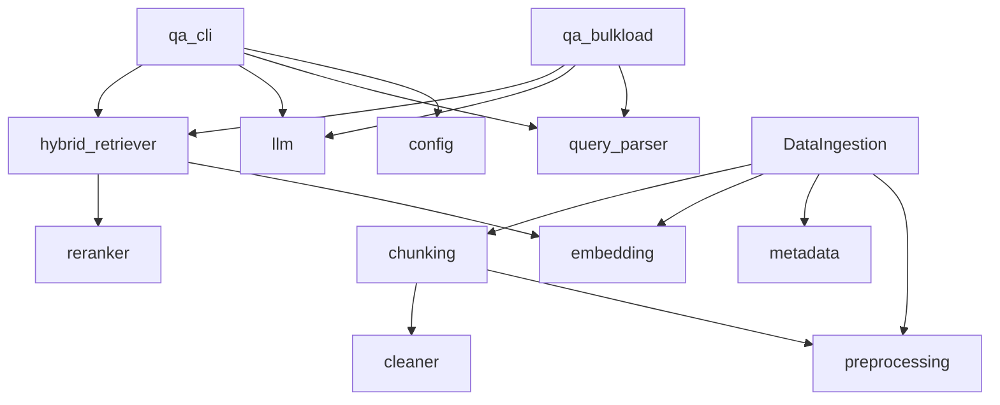

# Project Structure

## Table of Contents
- [Top-Level Files](#top-level-files)
- [Folders](#folders)
- [Package Modules](#package-modules)
- [Generated Artifacts](#generated-artifacts)
- [Import Graph](#import-graph)

## Top-Level Files

| File | Purpose | Used by |
| --- | --- | --- |
| `DataIngestion.py` | Main ingestion implementation and CLI. | Executed directly; imported by `rag_system.ingestion.DataIngestion`. |
| `README.md` | Short project usage guide. | Human readers. |
| `requirements.txt` | Dependency list. | Environment setup. |
| `.env` | Contains `GROQ_API_KEY` in this checkout. | `rag_system.llm.load_groq_api_key`; value is not reproduced. |
| `.gitignore` | Ignores env files, caches, logs, selected generated outputs. | Git. |
| `rag_results.xlsx` | Existing generated batch result. | Not imported. |

## Folders

| Folder | Current contents | Purpose |
| --- | --- | --- |
| `datasets/raw/pdfs` | 11 PDF files. | Source corpus. |
| `datasets/questions` | `questions.xlsx`. | Batch input. |
| `outputs/index` | JSON manifests and `faiss_index`. | Generated index artifacts. |
| `outputs/reports` | `rag_output.xlsx`. | Existing report output. |
| `rag_system` | Python package. | Application code. |
| `docs` | Documentation. | Human readers. |
| `scripts` | Empty. | No current runtime role. |
| `tests` | Empty. | No current tests. |
| `logs` | Empty. | No current file logger writes here. |

## Package Modules

| Module | Role |
| --- | --- |
| `qa_cli.py` | Active CLI and `answer_question` orchestration. |
| `qa_bulkload.py` | Excel batch runner. |
| `llm.py` | Groq key loading, prompts, and answer generation. |
| `hybrid_retriever.py` | Active retrieval pipeline. |
| `reranker.py` | Active CrossEncoder/fallback reranker. |
| `query_parser.py` | Query intent parser. |
| `metadata.py` | Paper labels, document metadata, record normalization. |
| `cleaner.py` | PDF cleanup and section detection. |
| `ingestion/chunking.py` | Content and metadata chunking. |
| `ingestion/embedding.py` | `PubMedEmbedder`. |
| `retrieval/*` | Alternate/older retrieval implementation, not active in `qa_cli`. |
| `utils/config.py` | `Settings`. |
| `utils/preprocessing.py` | Shared text normalization and metadata regex helpers. |

## Generated Artifacts

The current `metadata.pkl` payload contains schema version `3`, model `NeuML/pubmedbert-base-embeddings`, embedding dimension `768`, preprocessing tag `normalize_for_embedding:v1`, 290 records, and TF-IDF shape `(290, 30111)`.

## Import Graph

