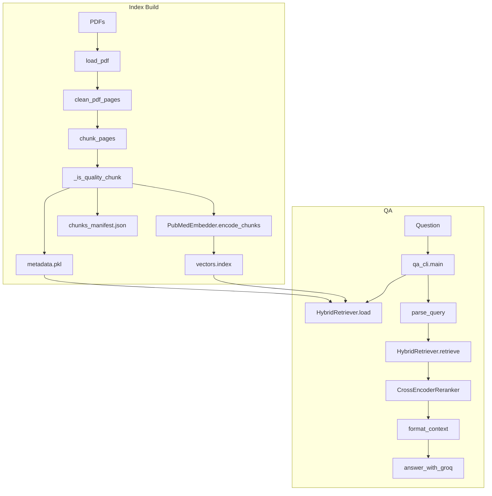
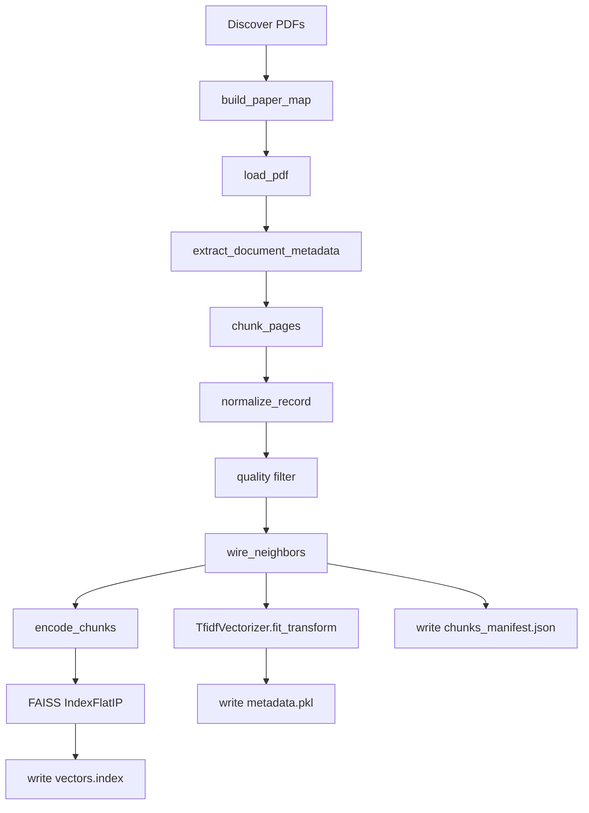
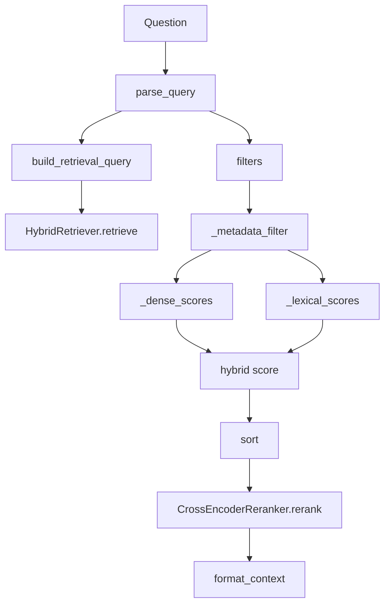
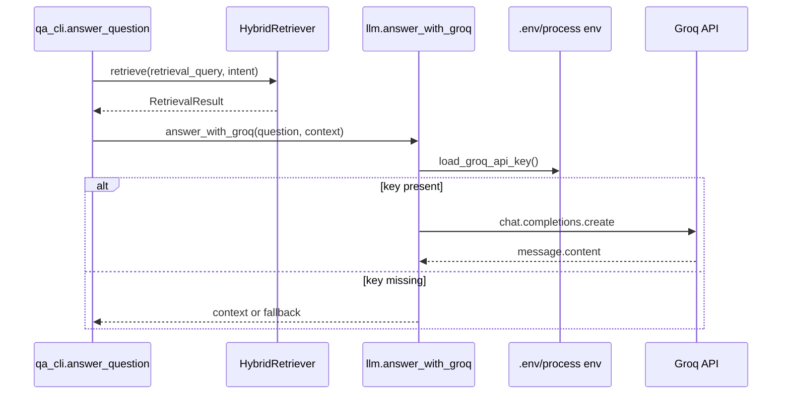
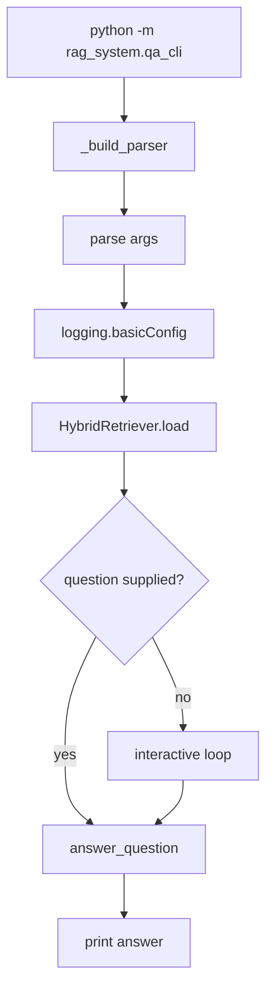

# System Architecture

## Table of Contents
- [Overall Architecture](#overall-architecture)
- [Indexing Pipeline](#indexing-pipeline)
- [Retrieval Pipeline](#retrieval-pipeline)
- [LLM Pipeline](#llm-pipeline)
- [Configuration Loading](#configuration-loading)
- [CLI Flow](#cli-flow)

## Overall Architecture

## Indexing Pipeline

## Retrieval Pipeline

## LLM Pipeline

## Configuration Loading

`qa_cli` uses `Settings().index_dir` as the default index directory. It does not call `Settings.from_env`. `llm.load_groq_api_key` independently searches upward for `.env` and loads the first one with `override=False`.

## CLI Flow

