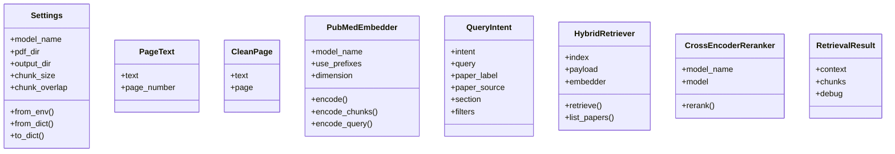
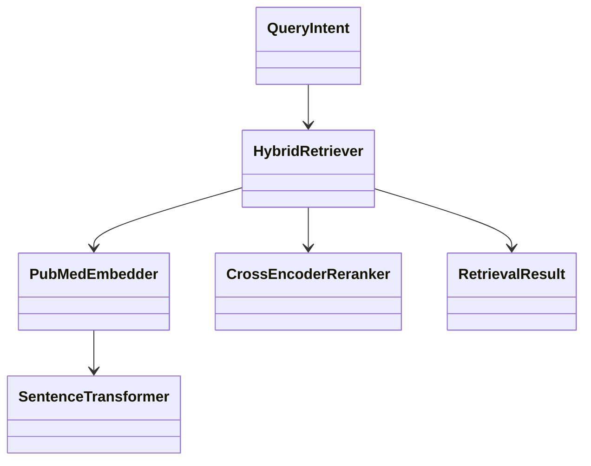

# Class Diagrams

## Table of Contents
- [Main Classes](#main-classes)
- [Relationships](#relationships)

## Main Classes

```mermaid
classDiagram
    class Settings {
      +model_name
      +pdf_dir
      +output_dir
      +chunk_size
      +chunk_overlap
      +from_env()
      +from_dict()
      +to_dict()
    }
    class PageText {
      +text
      +page_number
    }
    class CleanPage {
      +text
      +page
    }
    class PubMedEmbedder {
      +model_name
      +use_prefixes
      +dimension
      +encode()
      +encode_chunks()
      +encode_query()
    }
    class QueryIntent {
      +intent
      +query
      +paper_label
      +paper_source
      +section
      +filters
    }
    class HybridRetriever {
      +index
      +payload
      +embedder
      +retrieve()
      +list_papers()
    }
    class CrossEncoderReranker {
      +model_name
      +model
      +rerank()
    }
    class RetrievalResult {
      +context
      +chunks
      +debug
    }
```

## Relationships

```mermaid
classDiagram
    HybridRetriever --> PubMedEmbedder
    HybridRetriever --> CrossEncoderReranker
    HybridRetriever --> RetrievalResult
    QueryIntent --> HybridRetriever
    PubMedEmbedder --> SentenceTransformer
```
