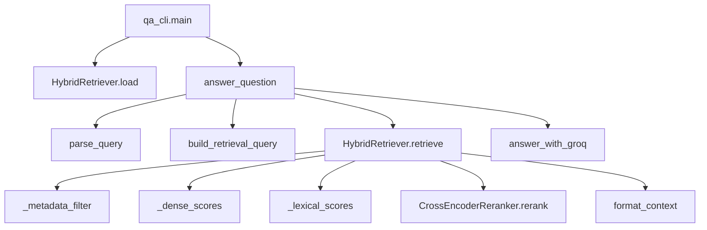
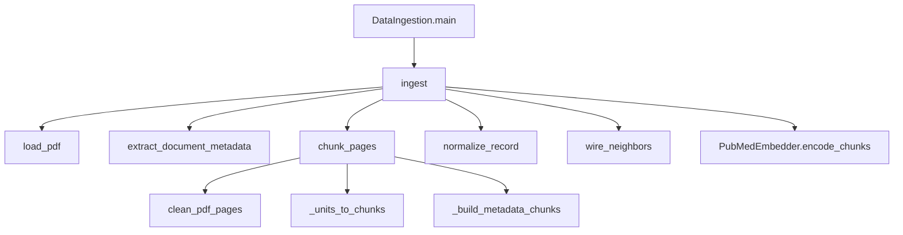
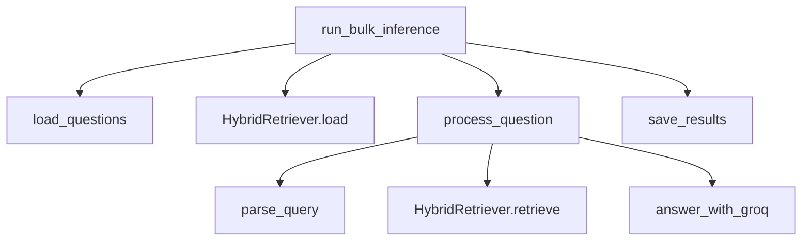

# Function Call Flow

## Table of Contents
- [QA Call Graph](#qa-call-graph)
- [Ingestion Call Graph](#ingestion-call-graph)
- [Bulk Call Graph](#bulk-call-graph)

## QA Call Graph

## Ingestion Call Graph

## Bulk Call Graph

