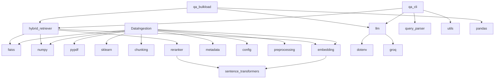
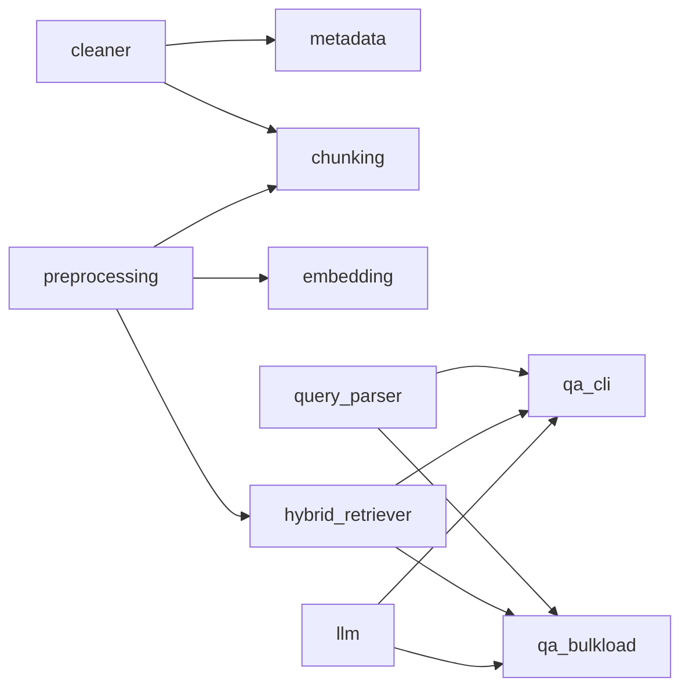

# Dependency Graph

## Table of Contents
- [Runtime Dependencies](#runtime-dependencies)
- [Internal Module Graph](#internal-module-graph)
- [External Package Usage](#external-package-usage)

## Runtime Dependencies

## Internal Module Graph

## External Package Usage

| Package | Used? | Location |
| --- | --- | --- |
| `faiss-cpu` | Yes | ingestion and retrieval |
| `numpy` | Yes | embeddings/retrieval |
| `pypdf` | Yes | PDF extraction |
| `scikit-learn` | Yes | ingestion TF-IDF |
| `sentence-transformers` | Yes | embeddings and reranker |
| `torch`, `transformers` | Indirect | sentence-transformers runtime |
| `groq` | Yes | LLM inference |
| `python-dotenv` | Yes | API key loading |
| `pandas`, `openpyxl` | Yes | batch Excel I/O |
| `pdfplumber` | Listed, not imported | none in current code |
| `langchain`, `langchain-community` | Listed, not imported | none in current code |
| `nltk`, `tqdm` | Listed, not imported | none in current code |
