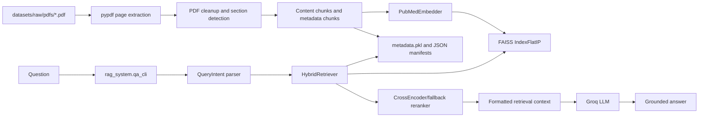

# Medical RAG Technical Documentation

## Table of Contents
- [Purpose](#purpose)
- [Problem Statement](#problem-statement)
- [Solution](#solution)
- [Architecture Diagram](#architecture-diagram)
- [Technology Stack](#technology-stack)
- [Folder Structure](#folder-structure)
- [Workflow Overview](#workflow-overview)
- [Navigation](#navigation)
- [Glossary](#glossary)

## Purpose

Medical RAG is a Python retrieval-augmented generation system for indexing biomedical research PDFs and answering questions against a local hybrid FAISS/lexical index. The active QA entry point is `python -m rag_system.qa_cli`. Batch inference is implemented in `python -m rag_system.qa_bulkload`. Index building is implemented by `DataIngestion.py` and compatibility shims in `rag_system.ingestion`.

## Problem Statement

The system answers questions from local PDF documents rather than from an LLM's general knowledge. It retrieves relevant PDF chunks, builds grounded context, and passes that context to a Groq-hosted LLM with strict citation and fallback instructions.

## Solution

| Layer | Actual implementation |
| --- | --- |
| PDF loading | `pypdf.PdfReader` in `DataIngestion.load_pdf` |
| Cleaning | `rag_system.cleaner` and `rag_system.utils.preprocessing` |
| Chunking | `rag_system.ingestion.chunking.chunk_pages` |
| Embeddings | `PubMedEmbedder` wrapping `sentence_transformers.SentenceTransformer` |
| Vector DB | FAISS `IndexFlatIP` persisted as `vectors.index` |
| Lexical retrieval | Stored TF-IDF payload plus active BM25-style lexical scorer |
| Reranking | `CrossEncoderReranker`, with hybrid-score fallback |
| LLM | `Groq.chat.completions.create` through `rag_system.llm.answer_with_groq` |

## Architecture Diagram



## Technology Stack

| Area | Package/module | Repository usage |
| --- | --- | --- |
| PDF | `pypdf` | Active PDF text extraction |
| Embeddings | `sentence-transformers`, `torch`, `transformers` | Dense passage/query vectors and optional CrossEncoder |
| Vector search | `faiss-cpu` | Exact inner-product vector index |
| Lexical search | `scikit-learn`, custom BM25-style scorer | TF-IDF persistence and active lexical rescoring |
| Excel | `pandas`, `openpyxl` | Batch input/output workbooks |
| LLM | `groq` | Answer generation |
| Env | `python-dotenv` | `.env` loading for `GROQ_API_KEY` |

## Folder Structure

```text
rag/
├── DataIngestion.py
├── requirements.txt
├── .env
├── datasets/raw/pdfs/              # 11 PDF files in this checkout
├── datasets/questions/questions.xlsx
├── outputs/index/faiss_index/      # vectors.index, metadata.pkl, legacy artifacts
├── outputs/index/*.json            # chunk and document metadata manifests
├── outputs/reports/                # existing generated report
├── rag_system/                     # package source
├── docs/                           # this documentation set
├── scripts/                        # empty in this checkout
├── tests/                          # empty in this checkout
└── logs/                           # empty in this checkout
```

## Workflow Overview

1. Ingestion discovers PDFs with `Path.rglob("*.pdf")`.
2. Pages are extracted into `PageText` objects.
3. Text is cleaned, section headings are detected, content chunks are built, and metadata chunks are added.
4. Chunks are normalized, quality-filtered, embedded, and stored in FAISS.
5. A pickle payload stores records, TF-IDF structures, paper map, document metadata, settings, and schema values.
6. The QA CLI loads the index and payload.
7. The query parser extracts paper, section, metadata, and list-papers intents.
8. The active retriever combines dense and lexical scores, reranks chunks, and formats context.
9. Groq generates a structured answer if `GROQ_API_KEY` is available; otherwise fallback behavior is used.

## Navigation

- [01 Project Overview](01_Project_Overview.md)
- [02 Project Structure](02_Project_Structure.md)
- [03 System Architecture](03_System_Architecture.md)
- [04 End-to-End Workflow](04_End_to_End_Workflow.md)
- [05 Document Ingestion](05_Document_Ingestion.md)
- [06 PDF Preprocessing](06_PDF_Preprocessing.md)
- [07 Text Cleaning](07_Text_Cleaning.md)
- [08 Chunking Strategy](08_Chunking_Strategy.md)
- [09 Metadata](09_Metadata.md)
- [10 Embedding Model](10_Embedding_Model.md)
- [11 Vector Database](11_Vector_Database.md)
- [12 Retrieval Pipeline](12_Retrieval_Pipeline.md)
- [13 Reranking](13_Reranking.md)
- [14 LLM Inference](14_LLM_Inference.md)
- [15 Query Processing](15_Query_Processing.md)
- [16 Context Building](16_Context_Building.md)
- [17 Response Generation](17_Response_Generation.md)
- [18 Configuration](18_Configuration.md)
- [19 Environment](19_Environment.md)
- [20 Logging](20_Logging.md)
- [21 Error Handling](21_Error_Handling.md)
- [22 Performance](22_Performance.md)
- [23 Improvement Possibilities](23_Improvement_Possibilities.md)
- [24 Code Walkthrough](24_Code_Walkthrough.md)
- [25 File By File Explanation](25_File_By_File_Explanation.md)
- [26 Class Diagrams](26_Class_Diagrams.md)
- [27 Function Call Flow](27_Function_Call_Flow.md)
- [28 Current Limitations](28_Current_Limitations.md)
- [Appendix](Appendix.md)

## Glossary

| Term | Meaning in this repository |
| --- | --- |
| Active retriever | `rag_system.hybrid_retriever.HybridRetriever`, used by CLI and bulk runner. |
| Metadata chunk | Structured chunk such as DOI, year, genes, diseases, study design, or abstract. |
| Payload | `outputs/index/faiss_index/metadata.pkl`, the authoritative retrieval bundle. |
| Paper ID | Label such as `paper 1`, assigned from sorted PDF filenames. |
| Fallback | Exact string `Not found in the document`. |

- [29 Function Reference](29_Function_Reference.md)
- [30 Class Reference](30_Class_Reference.md)
- [31 Dependency Graph](31_Dependency_Graph.md)
