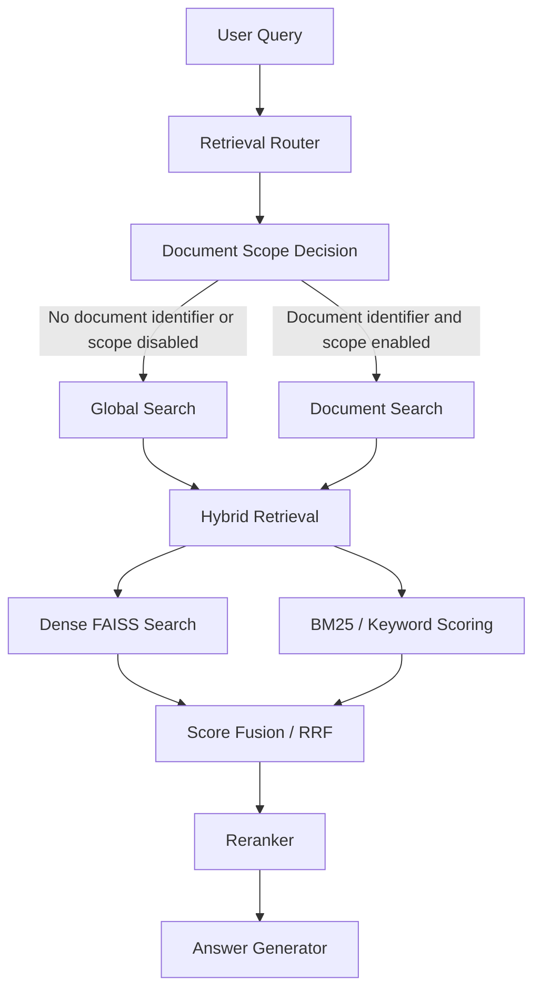
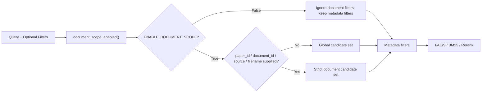
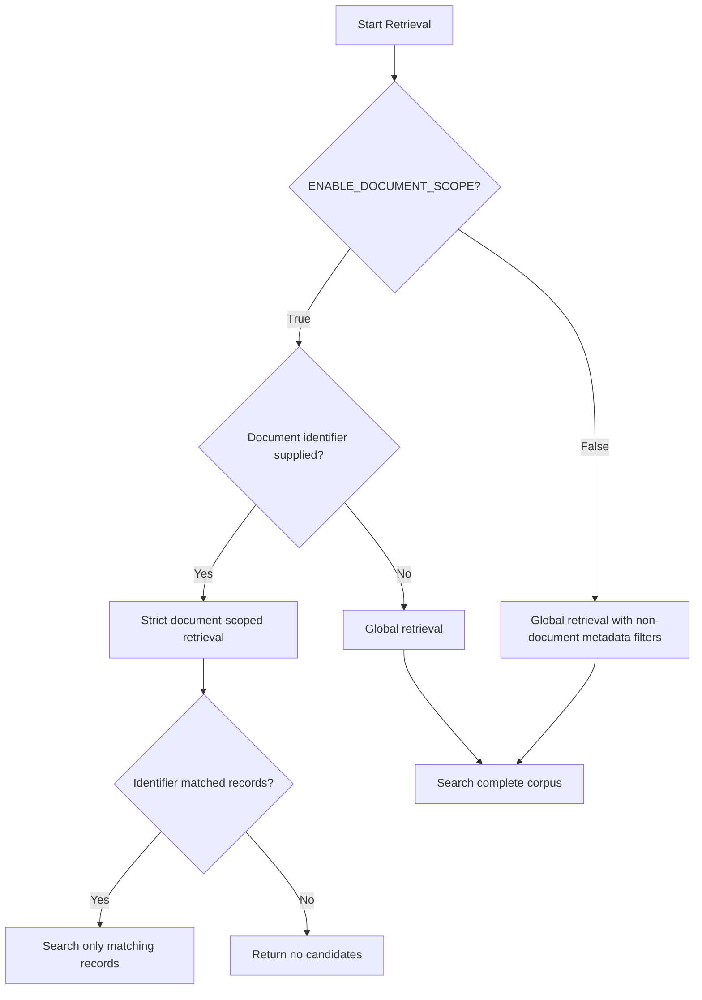
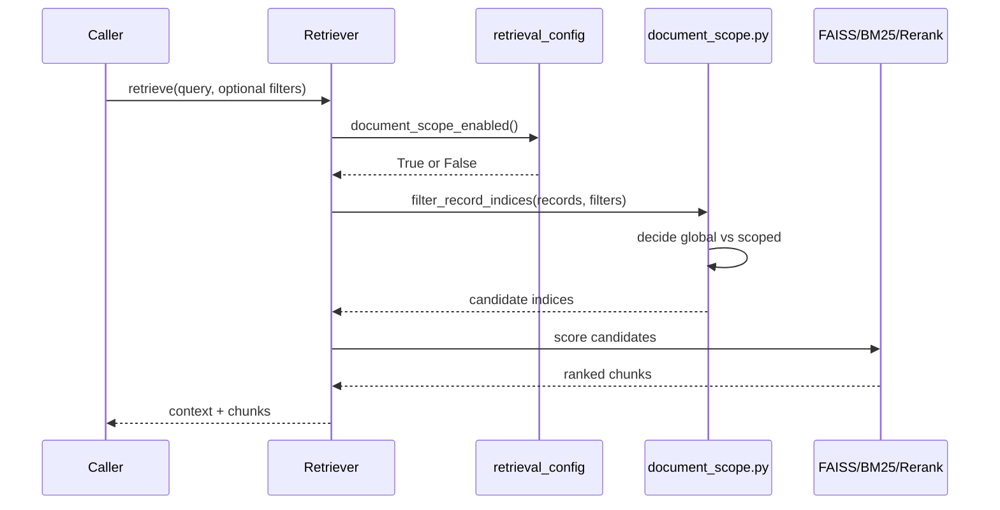

# Document Scope Configuration

## Table of Contents

- [Overview](#overview)
- [Architecture](#architecture)
- [Configuration](#configuration)
- [Automatic Decision Logic](#automatic-decision-logic)
- [Enabling Document Scope](#enabling-document-scope)
- [Disabling Document Scope](#disabling-document-scope)
- [Programmatic Examples](#programmatic-examples)
- [Internal Flow](#internal-flow)
- [Troubleshooting](#troubleshooting)

## Overview

Document-scoped retrieval exists to prevent cross-document contamination when a caller already knows the intended paper or source file. In that mode, identifiers such as `paper_id`, `document_id`, `doc_id`, `source`, and `filename` constrain retrieval before dense search, BM25 scoring, RRF fusion, reranking, and context construction.

Global retrieval is now the default because ordinary questions often do not specify a document identifier. When no document identifier is supplied, the system searches the complete corpus instead of rejecting the query. This avoids empty retrieval results for normal open-ended questions and removes the previous warning that required callers to pass `allow_global_search=True`.

The project-wide switch lives in [rag_system/retrieval/retrieval_config.py](../rag_system/retrieval/retrieval_config.py). Its default is:

```python
ENABLE_DOCUMENT_SCOPE = False
```

When document scope is disabled, document identity filters are ignored. Non-document metadata filters such as `section`, `year`, `disease`, `gene`, and `chunk_type` still apply.

## Architecture





## Configuration

The single source of truth is [rag_system/retrieval/retrieval_config.py](../rag_system/retrieval/retrieval_config.py).

| Setting | Default | Meaning |
| --- | --- | --- |
| `ENABLE_DOCUMENT_SCOPE` | `False` | Module-level switch used by retrieval components. |
| `config.enable_document_scope` | `False` | Dataclass-backed runtime value kept in sync by `set_document_scope()`. |
| `RAG_ENABLE_DOCUMENT_SCOPE` | unset | Environment variable read at import time by `retrieval_config.py`. Truthy values are `1`, `true`, `yes`, and `on`. |

`ENABLE_DOCUMENT_SCOPE=False` means document identifiers do not restrict retrieval. A call with `paper_id_filter="paper 1"` searches globally, while `section_filter="results"` still limits candidates to `results` chunks.

`ENABLE_DOCUMENT_SCOPE=True` means document identifiers restrict retrieval. A call with `paper_id_filter="paper 1"` returns only records whose document identifiers match that paper. If the identifier matches no records, retrieval returns no candidates unless the caller explicitly retries without the identifier or passes an explicit global fallback where supported.

## Automatic Decision Logic

The retrieval path automatically selects between global and scoped behavior.



Recognized document identifiers include:

| Caller field | Canonical behavior |
| --- | --- |
| `paper_id`, `paper_id_filter`, `paper_ids` | Document identity filter. |
| `document_id`, `document_id_filter`, `document_ids` | Document identity filter. |
| `doc_id`, `source_id`, `file_id` | Document identity aliases in `document_scope.py`. |
| `source`, `source_filter`, `sources`, `source_filters` | Source filename/path filter. |
| `filename`, `file_name` | Source filename aliases in `document_scope.py`. |

## Enabling Document Scope

Use document scope when the application has an explicit paper or file selected and must avoid cross-document retrieval.

Environment configuration:

```powershell
$env:RAG_ENABLE_DOCUMENT_SCOPE = "true"
python -m rag_system.qa_cli
```

Runtime configuration:

```python
from rag_system.retrieval.retrieval_config import set_document_scope

set_document_scope(True)
```

With scope enabled, scoped calls stay strict:

```python
result = retriever.retrieve(
    "What mutation was reported?",
    paper_id_filter="paper 1",
)
```

The candidate set is limited to records matching `paper 1`.

## Disabling Document Scope

Document scope is disabled by default. To make that explicit:

```powershell
$env:RAG_ENABLE_DOCUMENT_SCOPE = "false"
python -m rag_system.qa_cli
```

Runtime configuration:

```python
from rag_system.retrieval.retrieval_config import set_document_scope

set_document_scope(False)
```

With scope disabled, document identifiers are ignored, but ordinary metadata filters continue to apply:

```python
result = retriever.retrieve(
    "What were the survival outcomes?",
    paper_id_filter="paper 1",
    section_filter="results",
)
```

This searches all documents, constrained only to the `results` section.

## Programmatic Examples

Enable strict document scope:

```python
from rag_system.retrieval import retrieval_config

retrieval_config.set_document_scope(True)
```

Disable document scope:

```python
from rag_system.retrieval import retrieval_config

retrieval_config.set_document_scope(False)
```

Use the active `HybridRetriever` with automatic global retrieval:

```python
retriever = HybridRetriever.load("outputs/index/faiss_index")
result = retriever.retrieve("Which genes are discussed?", top_k=5)
```

Use `HybridRetriever` with strict document retrieval when enabled:

```python
from rag_system.retrieval.retrieval_config import set_document_scope

set_document_scope(True)
result = retriever.retrieve(
    "Which genes are discussed?",
    paper_id_filter="paper 2",
    top_k=5,
)
```

Use standalone `hybrid_search()` globally:

```python
candidates = hybrid_search(
    "EGFR treatment response",
    embedder,
    index,
    payload,
    candidate_k=10,
)
```

Use `retrieve_with_fallback()` with strict scoped retrieval:

```python
result = retrieve_with_fallback(
    "What was the response rate?",
    embedder,
    index,
    payload,
    source_filter="32969527.pdf",
    allow_global_search=False,
)
```

## Internal Flow

[rag_system/retrieval/retrieval_config.py](../rag_system/retrieval/retrieval_config.py) owns the configuration. Retrieval code calls `document_scope_enabled()` to resolve the current setting. Tests and runtime code can call `set_document_scope()` to update the setting in-process.

[rag_system/retrieval/document_scope.py](../rag_system/retrieval/document_scope.py) provides the shared metadata filter. `filter_record_indices()` always applies non-document metadata filters. It applies document identity filters only when document scope is enabled and a document identifier is supplied.

[rag_system/hybrid_retriever.py](../rag_system/hybrid_retriever.py) is the active retriever used by the CLI and bulk QA flows. Its `_metadata_filter()` method delegates to `filter_record_indices()`. It automatically allows global search for unscoped queries and keeps scoped queries strict unless the caller explicitly overrides `allow_global_search`.

[rag_system/retrieval/hybrid_search.py](../rag_system/retrieval/hybrid_search.py) is the standalone retrieval helper used by multi-query retrieval, HyDE, and `retrieve_with_fallback()`. It applies the same auto mode in `_source_positions()` and `hybrid_search()`. When document scope is disabled, source, paper, and document id filters are skipped while section filtering remains active.

[rag_system/retrieval/retriever.py](../rag_system/retrieval/retriever.py) is the legacy retriever. It now reads the same configuration and follows the same auto behavior in `_apply_metadata_filters()`.



## Troubleshooting

| Symptom | Likely Cause | Fix |
| --- | --- | --- |
| No candidates returned for an ordinary question | Caller explicitly passed `allow_global_search=False` with document scope enabled and no identifier. | Leave `allow_global_search=None` for automatic mode, or pass `allow_global_search=True` for explicit global search. |
| Wrong paper retrieved | `ENABLE_DOCUMENT_SCOPE` is `False`, so document identity filters are ignored. | Set `RAG_ENABLE_DOCUMENT_SCOPE=true` before process start or call `set_document_scope(True)`. |
| Global search disabled unexpectedly | A document identifier was supplied while document scope was enabled. | Remove `paper_id_filter`, `document_id_filter`, or `source_filter` for corpus-wide search, or pass explicit fallback only where appropriate. |
| Document scope ignored | The process is running with `ENABLE_DOCUMENT_SCOPE=False`. | Check `RAG_ENABLE_DOCUMENT_SCOPE`, `retrieval_config.ENABLE_DOCUMENT_SCOPE`, and runtime calls to `set_document_scope()`. |
| Section filter returns chunks from multiple documents | This is expected when no document identifier is supplied or document scope is disabled. | Add a document identifier and enable document scope when section filtering must be restricted to one document. |
| Legacy records without `paper_id` are not matched by paper filters | The record lacks that identity field. | Use `source_filter` or rebuild the index with complete metadata. |
